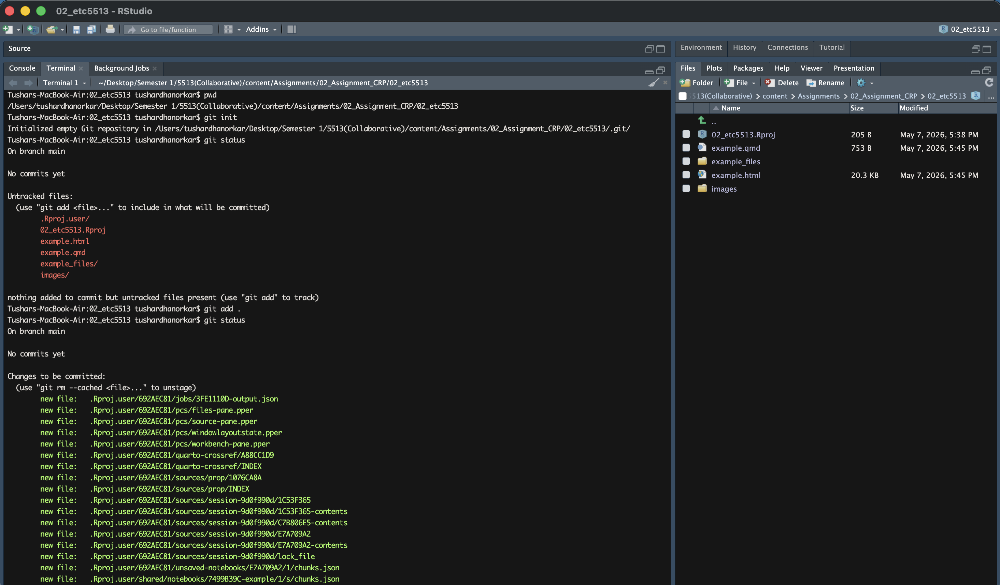

Assignment 2

This guide walk through ten practical steps demonstrating the use of Git, Github and Command line interface for Version control and collaboration. Each step explains what to do and why does this matters.

Step 1: Create the RStudio Project

What is an RStudio Project?

An RStudio Project is simply a folder on your computer that RStudio treats as a self-contained workspace. It keeps all your files, settings, and working directory in one place. When you open the project, RStudio automatically sets the working directory to that folder — which is important for reproducibility.

Part A: Create the RStudio Project

Open RStudio

Click File in the top menu → New Project.

A dialog box appears. Choose New Directory

Then choose New Project

You'll see a form:

Directory name: type 02_etc5513

Create project as subdirectory of: choose a location on your computer (e.g. your Desktop or Documents folder)

Click Create Project

RStudio will reload and you'll now be inside your new project. You'll notice the top-right corner of RStudio shows your project name. In the Files panel (bottom-right), you'll see one file: assignment2.Rproj

Part B: Create the example.qmd file

A .qmd file is a Quarto Markdown file — it lets you mix plain text, formatting, and R code chunks, then render it all into a nice HTML (or PDF, etc.) document.

Go to File → New File → Quarto Document...

A dialog appears:

Title: type something like "Assignment_02_Example"

Author: "Tushar Dhanorkar"

Make sure HTML is selected as the output format

Click Create

Your file will have a YAML header at the top (between the --- lines) and some default content. You can simplify it to look like this:

Part C: Render (Knit) the file to HTML

The YAML header controls the document settings. The \## Introduction is a heading. The \`\`\`{r} block is an R code chunk — it will run the R code and show the output in the rendered document.

Rendering" means Quarto takes your .qmd file, runs all the R code, and produces a finished HTML file.

Click the Render button at the top of the editor.

Step 2: Initialise Git and push to GitHub

What you need before starting:

Git installed on your computer (type git --version in your terminal to check)

A GitHub account at github.com

Git configured with your name and email (only needs to be done once):

Open the Terminal and navigate to your project folder

Go to Tools → Terminal → New Terminal

Or click the Terminal tab next to Console

You need to make sure you're inside your project folder. Since RStudio Projects automatically set the working directory, you should already be there. Confirm it by typing:

pwd

This prints your current directory. It should end with /02_etc5513

git init

This creates a hidden .git folder inside your project folder. That folder is what makes it a Git repository — it stores all version history.

git status

You'll see example.qmd, example.html , images/ , etcas untracked files.

git add .

stage all of them (tell Git you want to include them in the next commit), The . means "add everything in this folder"

git status

-   Files should now show in green under "Changes to be committed"

git commit -m "First commit add example.qmd and project files"

-   Now **commit** them with a clear message

Part B: Create a GitHub repository

Go to github.com and log in

Repository name: 02_etc5513

Click Create repository

Part C: Connect your local repo to GitHub and push

git remote add origin git\@github.com:dhanorkartushar2au-lgtm/02_etc5513.git

This command links your local repository to your GitHub repository - Adding new remote with nickname as Origin to the address of our Github repository i.e by SSH

git branch -M main

This command renames your current branch to main

git branch — used to manage branches , -M — means "force rename",main — the new name for your branch

git push -u origin main

This command uploads your local commits to GitHub.

Step 3: Create testbranch, Modify example.qmd, and Push:

When you create a branch, you get an exact copy of your current files to work on freely — without affecting the main branch. This is useful when you want to try something new or make changes without breaking your working code

Part A: Create and switch to testbranch

git checkout -b testbranch expected output: Switched to a new branch 'testbranch'

git checkout — switches branches,-b — means "create this branch if it doesn't exist",testbranch — the name of the new branch

git branch - This lists all branches. The one with a \*

Part A: Create and switch to testbranch and push

Modify example.qmd

Open example.qmd in RStudio and make a change to it. For example, add a new section

{r} x \<- c(10, 20, 30, 40, 50) mean(x)

git status - Check what changed, You'll see example.qmd listed as modified

git add . - Stage all modified files

git commit -m "Add new section to example.qmd on testbranch" - Commit with a clear message

git push -u origin testbranch - This pushes the branch to GitHub. The -u sets the upstream so future pushes on this branch only need git push

When we ran git add . AND git commit -m "Add new section to example.qmd on testbranch" changes were saved to our local repository.

When we ran git push -u origin testbranch Those same changes were uploaded to GitHub.

Step 4: Create data/ Folder, Add Assignment 1 Data, and Amend the Previous Commit

Amending means modifying the most recent commit — instead of creating a brand new commit, you update the last one to include something you forgot.

So in this case, we are going back to last commit in branch testbranch and saying that "we wanted to add data folder"

Ensure that we are on testbranch

git checkout testbranch - switch to testbranch we in case we are not in

Create the data/ folder and add your Assignment 1 data

mkdir data

This creates a folder called data inside your project.

git status we can see that data folder is unstage

git add data/ Stage the data folder

git status Now check the status and the data file(s) listed as staged under "Changes to be committed"

git commit --amend -m "Adding data folder"

git push --force origin testbranch

since we rewrote the last commit, a normal git push will be rejected so we need to do force push

Verification Go to your GitHub repository, switch to testbranch, and confirm data folder

Step 5: Switch to main and Create a Conflicting Change:

A merge conflict happens when two branches modify the same part of the same file in different ways. Git doesn't know which version to keep, so it asks you to decide manually.

In this step we deliberately creating that conflict by editing the same part of example.qmd on main that we already edited on testbranch

git checkout main - Switched to branch 'main'

git branch - Confirm we're on main

Check what example.qmd looks like on main

Notice that when you switched to main, the changes you made on testbranch are gone from your files. That's normal — each branch has its own version of the files.

Open example.qmd in RStudio. It should look like your original version from Step 1, without the new section you added on testbranch
